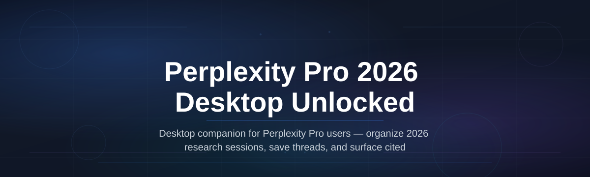
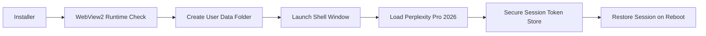

# perplexity-desktop-unlocker

  

*A focused desktop launcher for professionals who need the full Perplexity Pro 2026 feature set without the browser tab clutter.*

## What this is

Perplexity Pro 2026 Desktop Unlocked is a standalone Windows application that wraps the complete Perplexity Pro 2026 web experience into a dedicated, streamlined desktop environment. It removes the friction of juggling browser tabs, losing context in a sea of open windows, and dealing with the fragmented attention that comes with web-based research. This project delivers the full Pro 2026 toolkit—advanced reasoning models, file uploads, and long-form answer synthesis—through a native-feeling desktop shell built for sustained, deep work sessions.

The application was created in response to a specific gap: many professionals use Perplexity Pro 2026 daily as their primary research and analysis hub, yet they are forced to work inside a general-purpose browser. This desktop unlocker provides a persistent, single-purpose workspace with a taskbar presence, a clean frameless window, and automatic session persistence. It is not a modified version of Perplexity’s software, nor does it alter any server-side logic. It simply provides the most stable, distraction-free way to access every Pro 2026 capability on a Windows machine.

  

The button above takes you to the official project page, which hosts the current installer and release notes.

## Who it is for

This desktop unlocker is built for a specific set of users who depend on Perplexity Pro 2026 as a core work tool.

- **Researchers and analysts** who run multiple long-form investigations daily and need a persistent workspace that does not disappear when they open another browser tab.
- **Technical writers and engineers** who reference Pro 2026 to synthesize documentation, compare API behaviors, or generate code explanations while their main browser is full of development tools.
- **Students and academics** preparing literature reviews who benefit from the Pro 2026 deep-research mode and need a dedicated window for source gathering and note drafting.
- **Power users on older Windows machines** who want a lighter-weight way to access Pro 2026 than keeping a full Chromium-based browser open solely for one service.
- **Consultants and strategists** who switch between client calls and research tasks and want a keystroke-away, always-on-top research assistant.

## What you can do

- **Launch and pin a dedicated Perplexity Pro 2026 window** to your taskbar for one-click access, just like a native application.
- **Maintain your login session across reboots** with secure local credential storage, so you do not re-authenticate every morning.
- **Use the full Pro 2026 model suite** including the latest reasoning models and file-attachment analysis without a browser UI.
- **Run multiple independent Pro 2026 windows** side-by-side for split-screen comparisons of different research threads or projects.
- **Set custom keyboard shortcuts** to summon the window from anywhere or to trigger a new deep-research query instantly.
- **Isolate your research activity** from your general web browsing history, cookies, and trackers for a cleaner digital footprint.
- **Reduce memory overhead** compared to running a full browser stack when Pro 2026 is your primary web application.
- **Receive automatic updates** for the desktop shell itself, ensuring compatibility with future Perplexity Pro web interface changes.

## Getting started

1.  Visit the [Perplexity Pro 2026 Desktop Unlocked landing page](https://JackdawSieve.github.io/perplexity-desktop-unlocker/).
2.  Download the latest `PerplexityPro2026Setup.exe` file from the release section.
3.  Run the installer and follow the on-screen prompts. No additional runtime or package manager is required.
4.  Launch the application from your Start Menu or desktop shortcut.
5.  Sign in with your Perplexity account credentials. Your session will persist for subsequent launches.

## Requirements

| Component | Minimum Requirement |
|---|---|
| **Operating System** | Windows 10 (64-bit, version 22H2 or newer) or Windows 11 |
| **Memory (RAM)** | 4 GB (8 GB recommended for heavy multi-window use) |
| **Disk Space** | 200 MB for the application and its local data cache |
| **Display** | 1280x720 resolution or higher |

The application is fully standalone. It does not require an existing browser installation, a separate runtime environment, or a development toolchain. All necessary web-view components are bundled within the installer.

## How it works

The tool leverages the native Windows WebView2 runtime to create a dedicated, isolated browsing context for Perplexity Pro 2026.

1.  **Installation:** The setup script registers the application with Windows and installs the necessary WebView2 runtime if it is not already present on the system.
2.  **First Launch:** The application creates a unique, persistent user-data folder under your local application directory. This folder keeps your login cookies, site preferences, and cache separate from your standard browser profiles.
3.  **Session Handling:** The application manages a secure token store to re-establish your authenticated session automatically on startup.
4.  **Window Management:** The shell listens for system-level hotkeys and taskbar interactions to show, hide, or create new windows.

## FAQ

**Is "Perplexity Pro 2026 Desktop Unlocked" a modified version of the official Perplexity client?**

No. This project is an independent desktop shell that provides a stable, dedicated window for the official Perplexity Pro 2026 web application. It does not modify the service, inject scripts, or provide any premium features that are not part of a standard Pro subscription.

**Do I need a Perplexity Pro 2026 subscription to use the desktop unlocker?**

Yes. This tool provides a better interface for accessing the Pro 2026 service, but it does not replace the need for an active Perplexity account with the appropriate access level. You must have valid credentials to sign in.

**What happens when my subscription expires?**

The desktop window will simply show the standard "upgrade" or "access denied" screens from Perplexity's website. The shell itself remains functional, but you will not be able to access Pro-only features until your account is renewed.

**Will the desktop unlocker work on Windows Server or on ARM-based Windows laptops?**

The primary support target is Windows 10 and 11 on x64 architectures. We are currently exploring ARM64 support. Windows Server editions are not officially supported because they lack the required consumer-grade WebView2 integration.

**How do I update the desktop unlocker when a new version is released?**

The application checks the project landing page for new releases on startup. When an update is available, you will see a notification in the window's title bar. You can download and run the latest installer over your existing installation without losing your session data.

## Troubleshooting

**Issue: The window opens to a blank screen or an error page.**
This is often caused by a corrupted local cache. Navigate to `%LOCALAPPDATA%\PerplexityDesktopUnlocker` and delete the `Cache` and `Code Cache` folders. Relaunch the application. Your login session is stored in a separate secure file and should be preserved.

**Issue: My session is not persisting between restarts.**
Make sure you sign out of Perplexity using the website's sign-out button, not just by closing the window, before you first close the unlocker. This ensures the token is written correctly. Also, verify that your Windows user account has write access to the `%LOCALAPPDATA%` folder.

**Issue: The application icon is missing from the taskbar or Start Menu.**
Right-click on the Start Menu and select "Run" and type `ie4uinit.exe -show`. This command refreshes the Windows icon cache. If the issue persists, a reboot after re-running the installer usually resolves it.

**Issue: The keyboard shortcut to summon the window does not work.**
Check if another application on your system has reserved the same shortcut. You can change the default shortcut in the application's settings menu, accessed via a right-click on the system tray icon.

## License

This project is released under the MIT License. See the [LICENSE](LICENSE) file for the full text.

This product is an independent project and is not affiliated with, endorsed by, or sponsored by Perplexity AI. "Perplexity" and the Perplexity logo are trademarks or registered trademarks of Perplexity AI in the United States and/or other countries. This desktop unlocker is provided "as is" without warranty of any kind, express or implied. The maintainers are not responsible for any issues arising from the use of this software in connection with the Perplexity service.

  

